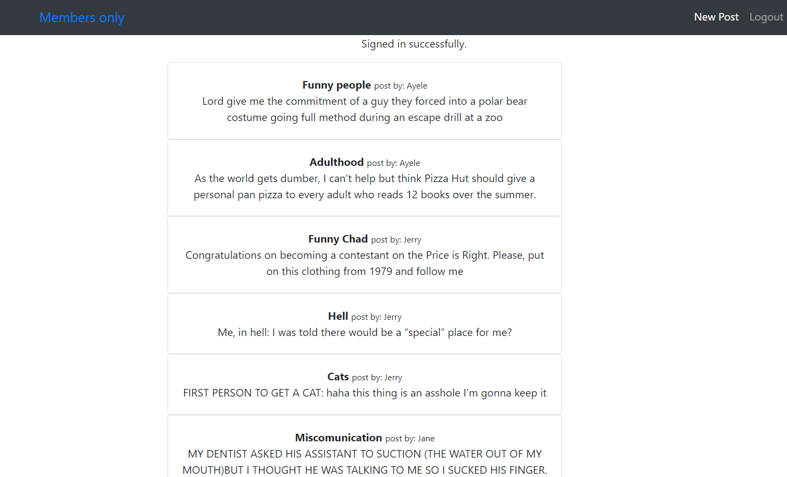
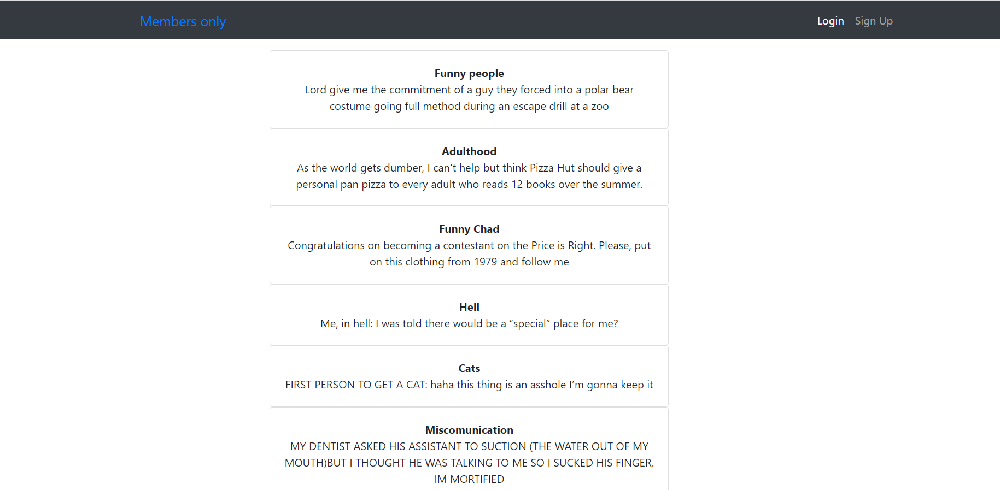

# Members Only Rumor Mill

### This is a simple blog app with ROR sessions to authorize view access to member users only.

[![Contributors][contributors-shield]][contributors-url]
[![Forks][forks-shield]][forks-url]
[![Stargazers][stars-shield]][stars-url]
[![Issues][issues-shield]][issues-url]
[![License: MIT][license-shield]][license-url]
[![LinkedIn][linkedin-shield]][linkedin-url]

### Logged in Interface

### Guest Interface

## Built With

- Ruby on Rails
- Devise
- Simple_form
- Bootstrap
- sqlite 3
- VScode
- Rubocop

## Getting Started on local repo

To get a local copy up and running follow these simple example steps.

### Install

In order to run, you need to install RUBY and Rails in your computer. For windows you can go to [Ruby installer](https://rubyinstaller.org/) and for MAC and LINUX you can go to [Ruby official site](https://www.ruby-lang.org/en/downloads/) for intructions on how to intall it.

Clone this project by typing `git clone git@github.com:sinework/members-only.git`

### Run app

- Type `bundle install` in the root file of the project.
- Type `rails db:migrate` in the root file of the project.
- Type `rails s` in the root file of the project.
- Goto [local host](http://localhost:3000/)
- You can go to rails console by typing `rails console` and create a user by using Active Record commands and methods.

## Author

👤 **Sinework Amare Shiferaw**

- Github: [@sinework](https://github.com/sinework)

- LinkedIn: [LinkedIn](https://www.linkedin.com/in/sinework-amare-731a6a125/)

## 🤝 Contributing

Contributions, issues and feature requests are welcome!

## Show your support

Give a ⭐️ if you like this project!

## Acknowledgments

- Microverse

## 📝 License

This project is [MIT](LICENSE) licensed.
